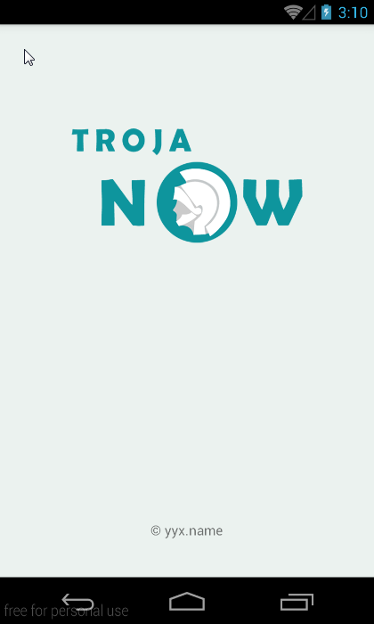
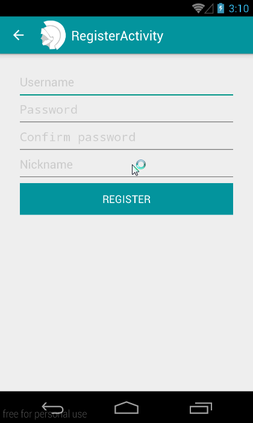
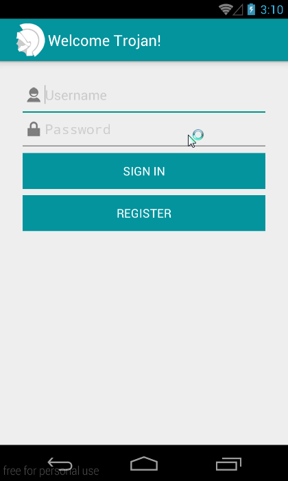
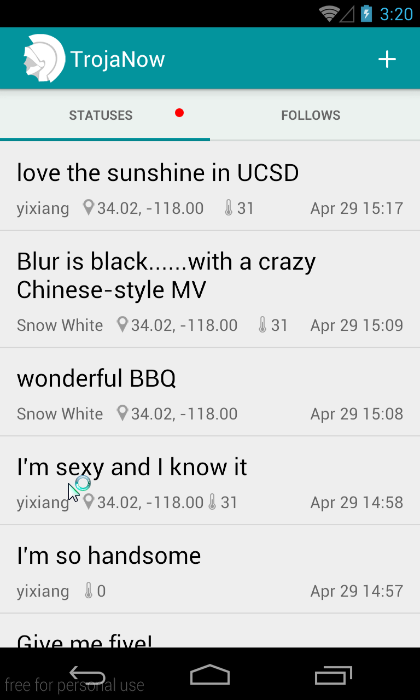
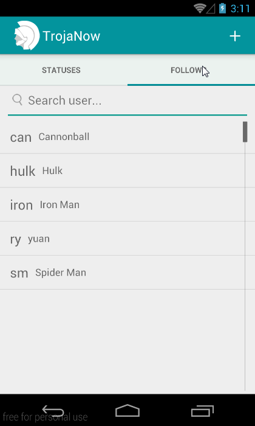
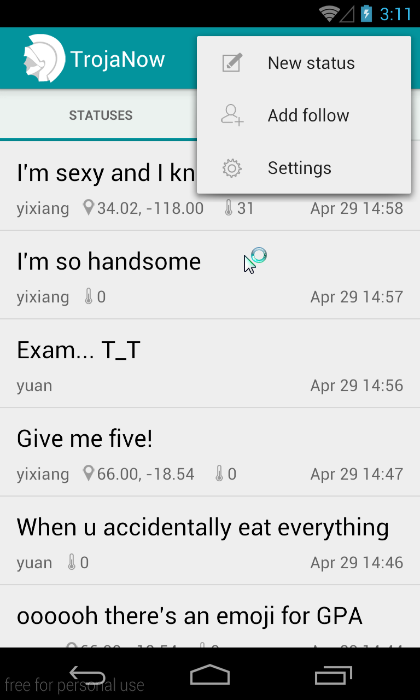
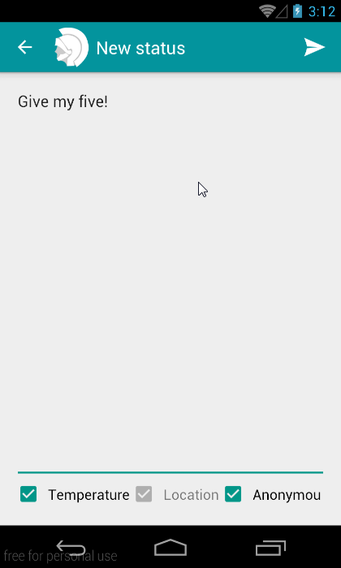
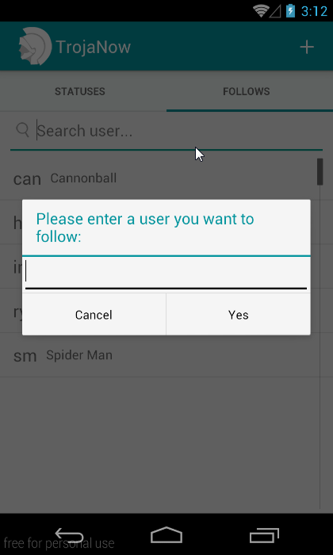
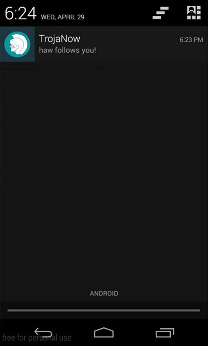
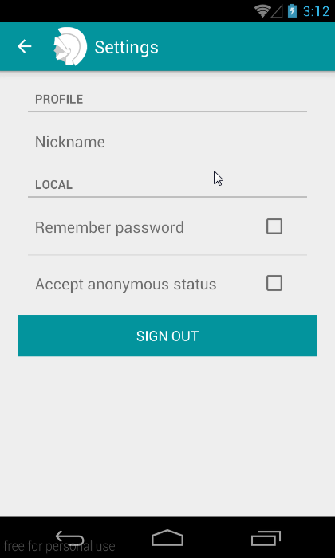

# TrojaNow #

TrojaNow is the final project For USC CSCI-578 Spring 2015 by GreatYYX and EowynREN.
It includes a server and a mobile app.

Server constructs in LAMP+memcached+mosquitto and provides RESTful API and pushback notifications.
Mobile App is written in Android which implements user's register/signin/out, posting normal or anonymous statues with location and temperature, managing follows, etc.
All of them are designed under the rule of software architecture (MVC, Layered, Publish-Subscribe, Broadcast, etc).

Feel free to contact us if you have any questions.

# Structure #

- `/server/` contains all files in server, configuration details are in `/server/README.md`.
- `/TrojaNow/` Android mobile app, the released apk file is under `/TrojaNow/app`.
- `/protocol.md` protocol for RESTful API and pushback notifications.

# Further Works

- It's not easy for mobile apps creating P2P chatting under 2 different private local networks for NAT, although there is a technology called NAT Punch-through.
- Security of data exchange of server and app should be enhanced.

# Screenshots

